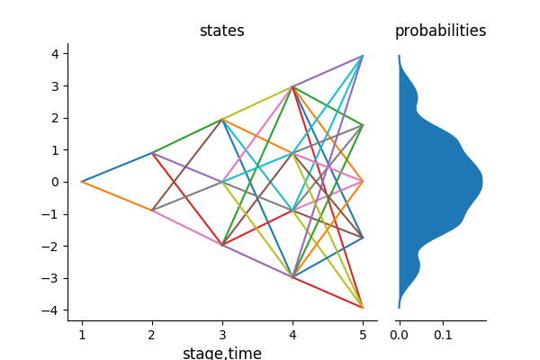

```@meta
CurrentModule = ScenTreesMakie
```

# Scenario Lattices

If the data process is Markovian, we approximate the process with a _scenario lattice_ instead of a scenario tree. Scenario lattices are natural discretizations of the Markov processes.

A scenario lattice is similar to a scenario tree but has an added requirement that all nodes in stage `t` have the same children. This makes the description of a scenario lattice less than for a scenario tree as a scenario lattice can only be described by its name, states of the nodes in the lattice and the probabilities of transition in the lattice.

In a scenario lattice, the total number of nodes is equal to the total number of states which is equal to the sum of the elements in the branching vector.

Consider the scenario lattice below with branching structure `1x2x3x4x5`:

```julia
julia> ExampleLattice = lattice_approximation([1,2,3,4,5],gaussian_path1D,1000000,2,1);
julia> plot_lattice(ExampleLattice)
```



In the above scenario lattice, the total number of nodes are ``1+2+3+4+5 = 15`` nodes and the total number of edges in the lattice are ``(1 \times 2)+(2 \times 3)+(3 \times 4)+(4 \times 5) = 40`` edges. A scenario tree with the same branching structure has `153` nodes and `153` links. This shows that, in a lattice, the number of variables do not grow exponentially as it does in a scenario tree. However, the number of possible paths in a scenario lattice is larger than in a scenario tree.

Some of the characteristics of a scenario lattice are:

1. You will notice that a states and the probabilities of the lattice are of type `Array{Array{Float64,2},1}`. This is because of the fact that the nodes of the lattice can have multiple predecessors.
2. The number of states in the scenario lattice is equal to the number of nodes. The number of nodes is given by the sum of elements in the branching vector.
3. Scenario lattices are used for Markovian processes; which are memory-less processes. Therefore, the number of probabilities to reach one node is equal to the number of predecessors of that node.
4. The sum of all probabilities in each stage equals to one.
5. Just like in a scenario tree, a scenario lattice has one root node. Each node in the lattice has multiple predecessors except the root node.
